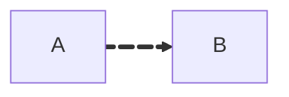

## [flowchart](https://mermaid.js.org/syntax/flowchart.html)

### Forms
```mermaid
---
title: Title
---
flowchart TD
	first_node[Square **MD**]
	second_node(
		Round _Edge_
	)
	third_node([Stadium-shape])
	fourth_node[[subroutine]]
	fifth_node[(Database)]
	sixth_node((Circle))
	seventh_node{Romb}
	eighth_node[/Parallelogram/]
	
	
	first_node --> second_node --> third_node --> fourth_node
	fifth_node --> sixth_node --> seventh_node --> eighth_node
	
	%% Новый стиль
	A@{ shape: delay, label: "Label" } -->
	B@{ icon: "fa:LiActivity:", label: "Label", form: "circle", pos: "t"} -->
	C@{ img: "https://cdn4.iconfinder.com/data/icons/small-n-flat/24/cat-alt-1024.png", label: "Image Label", pos: "b", h: 60, constraint: "on" }
```

### [Node Links](https://mermaid.js.org/syntax/flowchart.html#selecting-type-of-animation)


### [Arrow Types](https://mermaid.js.org/syntax/flowchart.html#selecting-type-of-animation)


### [Animation](https://mermaid.js.org/syntax/flowchart.html#selecting-type-of-animation)



### [Subgraphs](https://mermaid.js.org/syntax/flowchart.html#subgraphs)


### [Interaction](https://mermaid.js.org/syntax/flowchart.html#interaction)


### [Styling](https://mermaid.js.org/syntax/flowchart.html#styling-and-classes)

### [Font Awesome](https://mermaid.js.org/syntax/flowchart.html#basic-support-for-fontawesome)
<link href="https://cdnjs.cloudflare.com/ajax/libs/font-awesome/6.5.1/css/all.min.css" rel="stylesheet"/>

