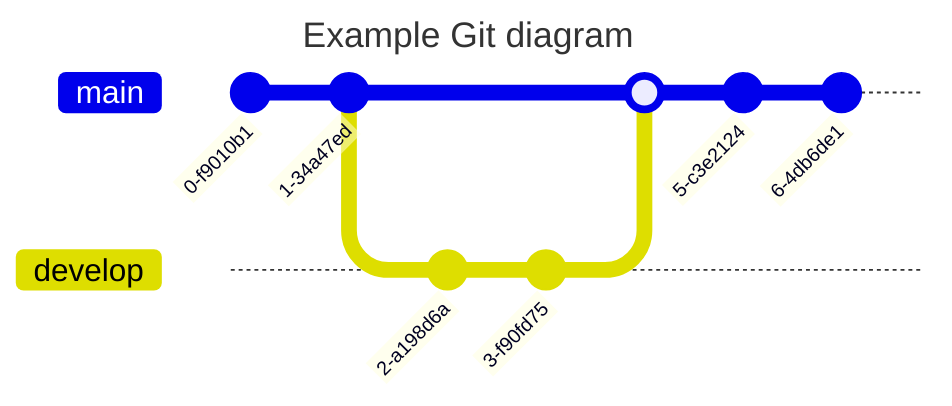

### [sequenceDiagram](https://mermaid.js.org/syntax/sequenceDiagram.html#sequence-diagrams)


### [classDiagram](https://mermaid.js.org/syntax/classDiagram.html#class-diagrams)


### [stateDiagram](https://mermaid.js.org/syntax/stateDiagram.html)


### [entityRelationshipDiagram](https://mermaid.js.org/syntax/entityRelationshipDiagram.html)


### [userJourney](https://mermaid.js.org/syntax/userJourney.html)


### [gantt](https://mermaid.js.org/syntax/gantt.html)


### [pie](https://mermaid.js.org/syntax/pie.html)


### [quadrantChart](https://mermaid.js.org/syntax/quadrantChart.html)


### [requirementDiagram](https://mermaid.js.org/syntax/requirementDiagram.html)


### [gitgraph](https://mermaid.js.org/syntax/gitgraph.html)


### [c4](https://mermaid.js.org/syntax/c4.html)


### [mindmap](https://mermaid.js.org/syntax/mindmap.html)


### [timeline](https://mermaid.js.org/syntax/timeline.html)


### [zenuml](https://mermaid.js.org/syntax/zenuml.html)


### [sankey](https://mermaid.js.org/syntax/sankey.html)


### [xyChart](https://mermaid.js.org/syntax/xyChart.html)


### [block](https://mermaid.js.org/syntax/block.html)


### [packet](https://mermaid.js.org/syntax/packet.html)


### [kanban](https://mermaid.js.org/syntax/kanban.html)


### [architecture](https://mermaid.js.org/syntax/architecture.html)


### [radar](https://mermaid.js.org/syntax/radar.html)
```mermaid
radar-beta
axis A, B, C, D, E
curve c1{1,2,3,4,5}
curve c2{5,4,3,2,1}
```

### [treemap](https://mermaid.js.org/syntax/treemap.html)
```mermaid
treemap-beta
"Section 1"
    "Leaf 1.1": 12
    "Section 1.2"
      "Leaf 1.2.1": 12
"Section 2"
    "Leaf 2.1": 20
    "Leaf 2.2": 25
```