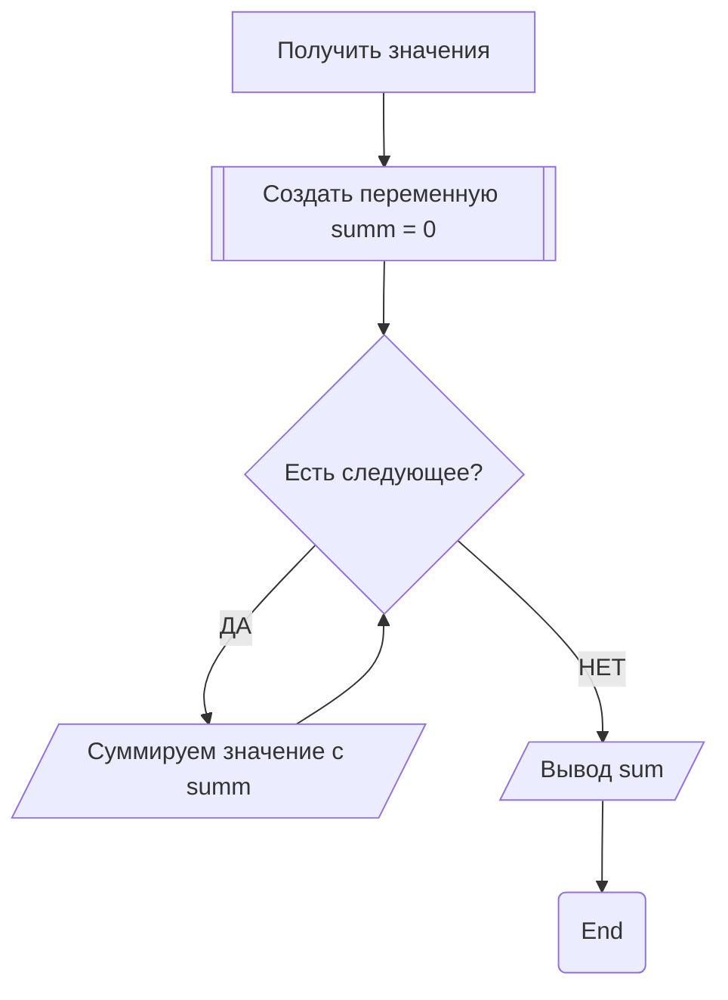

```mermaid
flowchart TB
input[Получить значения] --> var[[Создать переменную summ = 0]] a@--> check_next{Есть следующее?}


check_next --ДА--> sum[/Суммируем значение с summ/] --> check_next
check_next --НЕТ--> output[/Вывод sum/] --> finish(End)
```